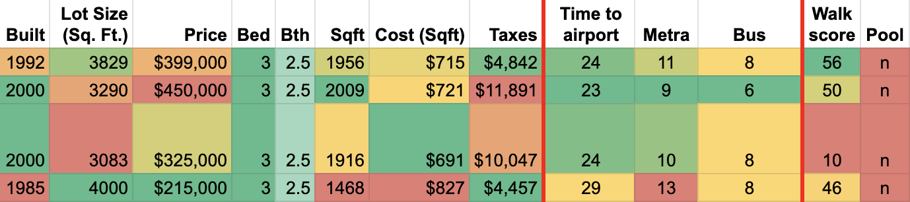

A python script that produces a CSV ready dump of house properties for further manipulation via spreadsheet.

The script also calculates distance to popular transit locations as well as finds the walk score.

Example use:

```
$ python3 app.py "123 Street, City, ST ZIP"

Built,Lot,Price,Bed,Bth,Sqft,Cost (Sqft),Taxes, AIR, METRA, BUS, walkscore
1963,6999,378000,4,2.0,1340,229,7149.06,27,7,11,29
```



# Prerequisites

- Google Cloud Project
    - Billing
    - DISTANCE MATRIX API enabled
    - [API Key created to use the API](https://github.com/googlemaps/google-maps-services-python#api-keys)
- Walk Score [API Key](https://www.walkscore.com/professional/api-sign-up.php)

# Run manually

Set env variables

```
export KEY=<GCP MAPS API KEY>
export WS=<WALKSCORE API KEY>
```

Install required packages and use python

```
pip3 install -r requirements.txt
python3 app.py "36 Lawrence Rd, Alameda, CA 94502"
```

# Run with Docker

```
docker run -e KEY -e WS redfin-sheets:v0.1 "3044 Pine St, San Francisco, CA 94115"
```

# Maintain

Generate / update requirements.txt

```
pip install pipreqs
pipreqs ./ --force 
```

Build the docker container

```
docker build -t redfin-sheets:v0.1 . 
```
